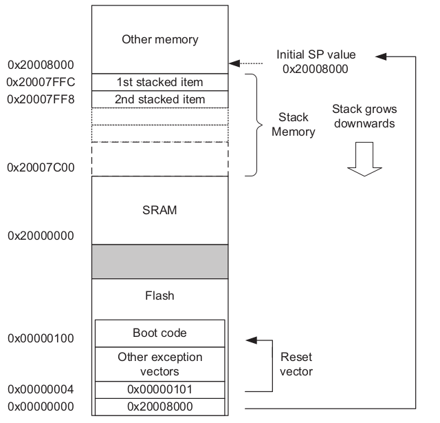
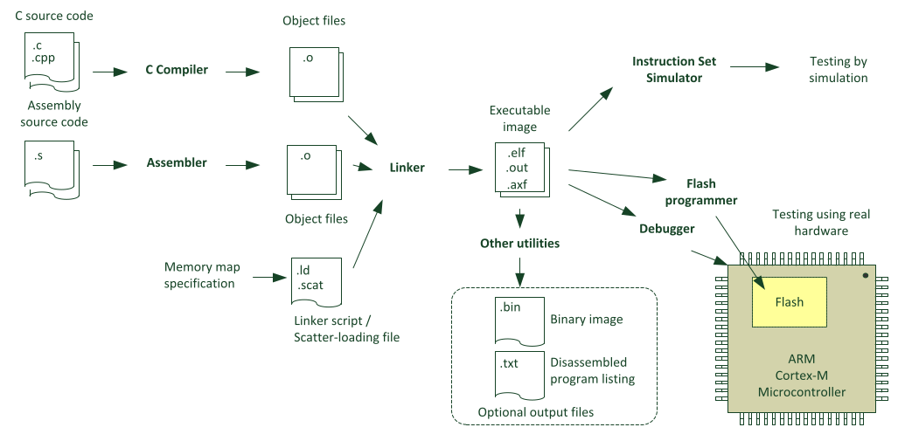

# Bare metal embedding

## Theoretical background

### Some definitions

A platform or "target" is represented with a three component string, separated with dashes:

```txt
<ISA|Arch>-<OS>-<EABI>

Examples:
    "arm-none-eabi" (arm, no OS, eabi)

    "thumbv7em-none-eabihf" (thumb arm v7 extended, Cortex-M, without OS, eabi with hardware floats)

```

Where:

* **ISA (Instruction Set Architecture)**: It's the assembly language used.

* **Architecture**: Processor licenser.

* **OS**: The actual operating system (if any) that will be running on the device.

* **EABI (Embedded Application binary interface)**: specifies standard conventions for file formats,
data types, register usage, stack frame organization, and function parameter passing of an embedded
software program.

[A comprenhensive list of platform targets](https://doc.rust-lang.org/nightly/rustc/platform-support.html).

### Memory map

When a program is flashed into an embedded device, its stored in the ROM (Read Only Memory). However, the program is not able to be run normally from the ROM because, for example, variables can't be freely modified and its considerably slower to execute code from there compared to the RAM (Random Access Memory).

The **bootloader** is a special code, written in Assembly and executed from the ROM, which should handle all the following steps before executing the main program:

* Copy all code (.text) and data (.rodata, .data, .bss, .COMMON, etc) from the ROM into the RAM.

* Copy the vector table into the correct place.

* Initialize all hardware dependant registers.



## What's needed to flash a program



* The **Compiler** and **Assembler** interpret the "C" and "Assembly" code and parse it to machine code, generating the ".o" object files.

* The **Linker** merges all the object files into an executable image ".elf". An extra file called *linker script* ".ld" tells the linker how to generate the image, providing the FLASH and RAM memory addresses and lenght, as well as the stack pointer initial address.

* The **Debugger** (gdb) or **Flash programmer** (stlink) will load the program to the flash memory.

* Optional utilities are the **Binary file generation tool** (objcopy) and the **Disassembler** (objdump).

The ".elf" extension (Executable Linkable Format) has all the binary data plus headers that tell exactly the size of the data, the offsets in memory, differentiates between "text", "data" and "bss", etc. On the other hand, the ".bin" format it's just raw bits, with no headers, that start from offset "0" of memory. Therefore, flashing an ".elf" file is straighforward, meanwhile for a ".bin" file the memory offset must be supplied.

"objdump" prints all the information from the ".elf" file.

objcopy -O binary main.elf main.bin converts the file to binary format.


NOTE: agregar archivo openocd en /etc/udev/rules.d

## Minimal

This is the bare minimum files an configuration needed to run a program in an embedded device.

The application code is written in the `core.s` file. There, we define the vector table with only the first two entries: the MSP (Main Stack Pinter) address and the reset_handler for the exception. When the code resets, it will load the MSP into the SP register, and jump to the reset_handler code location.

```bash
# Compile object files
arm-none-eabi-gcc -c -g -mcpu=cortex-m4 -mthumb -Wall core.s -o core.o

# Link using the linker file.
arm-none-eabi-gcc core.o -mcpu=cortex-m4 -mthumb -Wall --specs=nosys.specs -nostdlib -lgcc -T"$PWD/link.ld" -o main.elf

# Print information about the archive
arm-none-eabi-nm main.elf

# Open GDB
gdb-multiarch main.elf

# On diffetent terminal
openocd

# Inside gdb program, connect to openocd and load the code
(gdb) target extended-remote :3333
(gdb) load
```

## Including device startup code from the microcontroller vendor

Having only assembly and the reset handler exception defined is not very useful. Besides, all the register memory addresses should be mapped by hand. Let's include the startup code provided by the microcontroller vendor.

So far, the program compiles, but i can't debug it properly. Rubbish is loaded into the device.

```bash
mkdir build
cd build
cmake ..
cmake --build .
gdb-multiarch aaa

# In a new terminal
openocd

# Inside gdb
(gdb) target extended-remote :3333
(gdb) load
```
